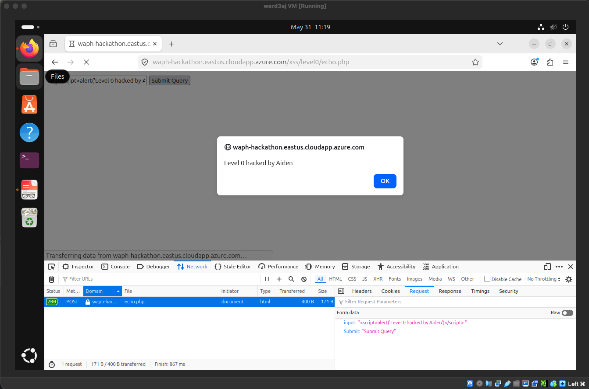
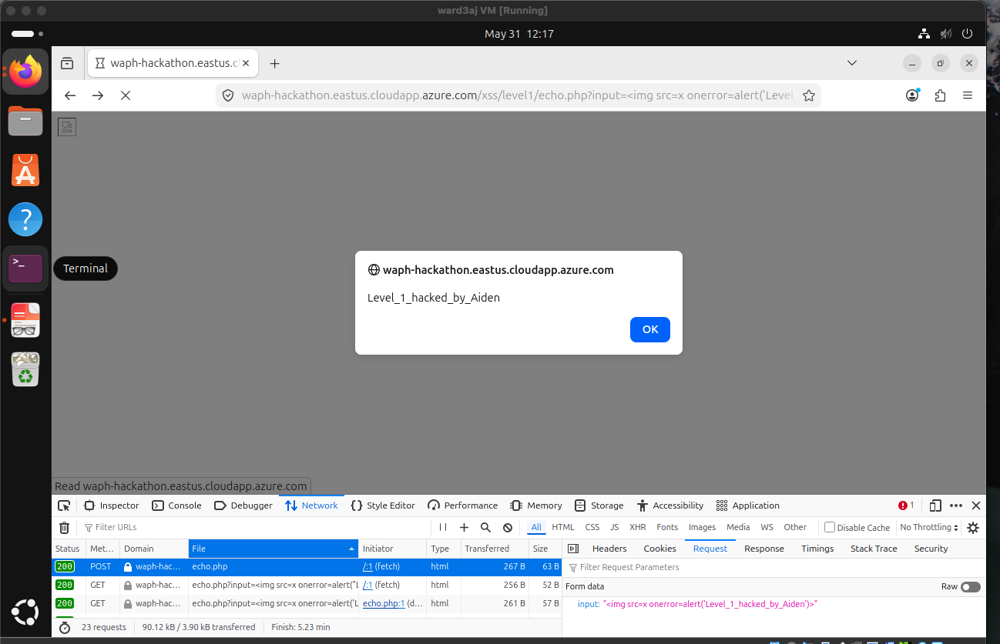
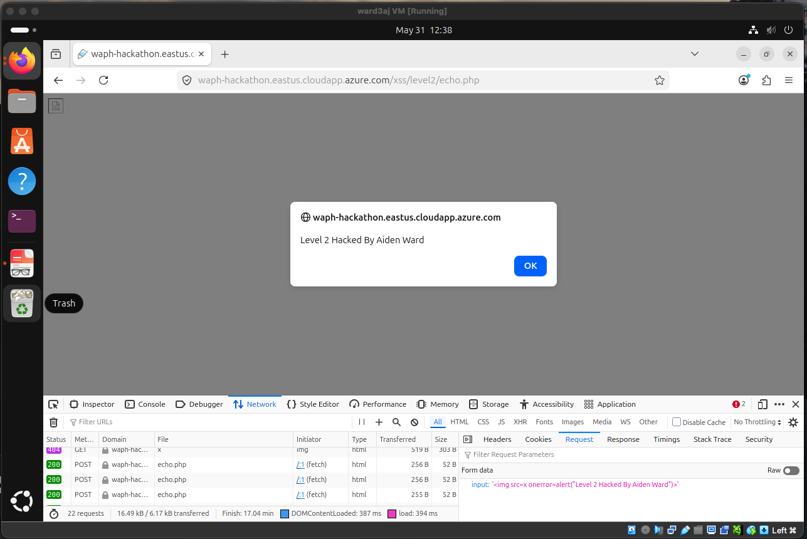
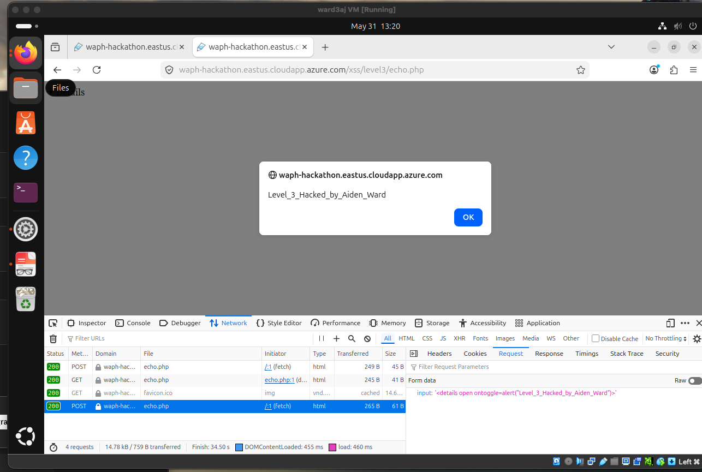
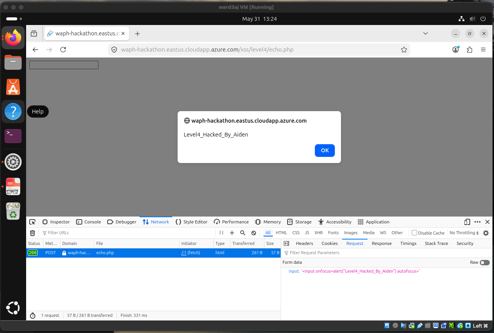
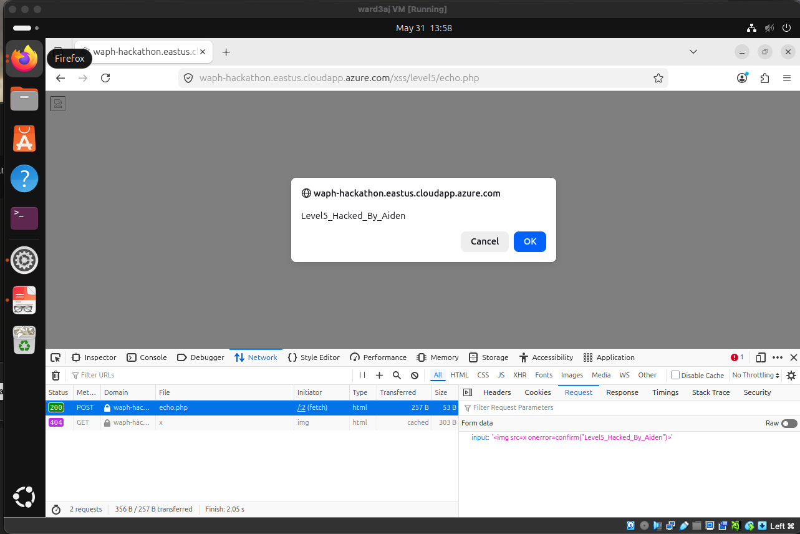
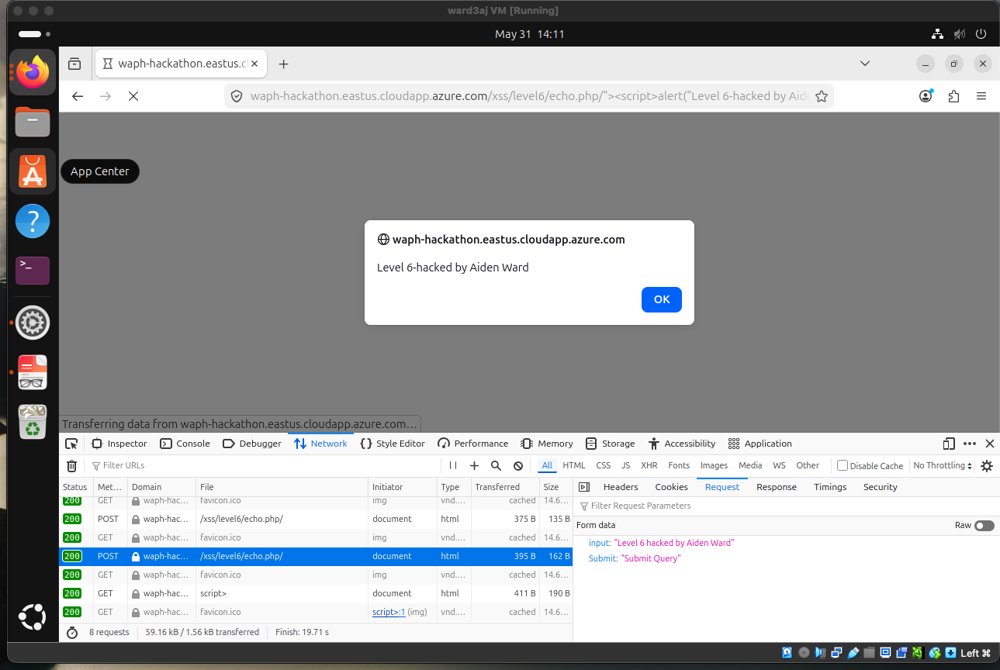
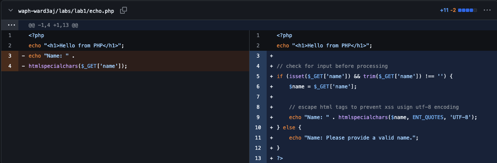
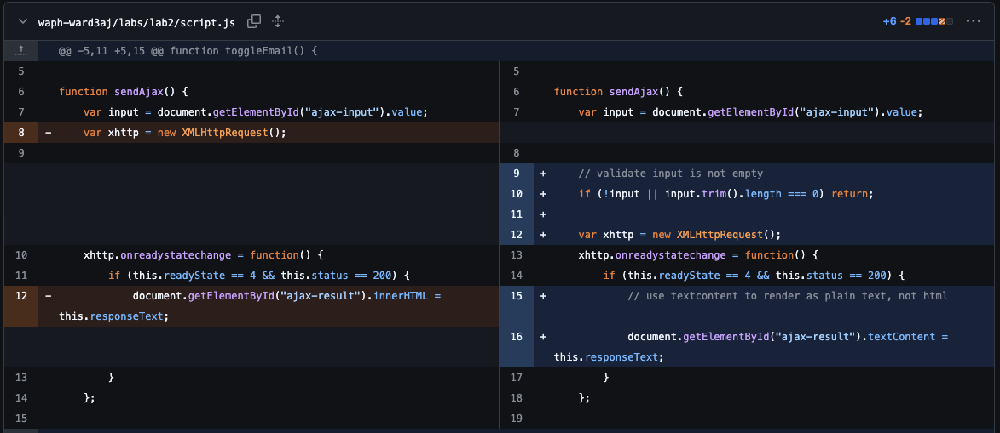
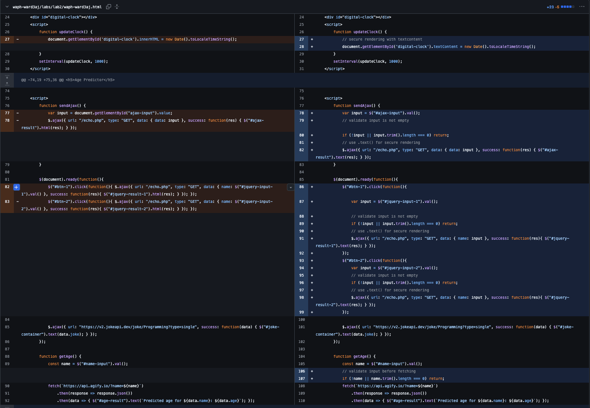

# WAPH-Web Application Programming and Hacking

## Instructor: Dr. Phu Phung

## Student

**Name**: Aiden Ward

**Email**: [ward3aj@mail.uc.edu](ward3aj@mail.uc.edu)

**Short-bio**: Aiden Ward has a lot of interest in computer science, specifically data science. I also love volleyball and cars.


## Repository Information

Respository's URL: [https://github.com/aidenward6/waph-ward3aj/tree/main/waph-ward3aj/labs/hackathon1](https://github.com/aidenward6/waph-ward3aj/tree/main/waph-ward3aj/labs/hackathon1)

## Overview

As this is the first hackathon for this class, I was slighly worried on making sure that I was doing everything correctly. Overall, I think that I satisfied all of the requirements, and I had a great time doing it. This took me the whole day, however I feel like it was very worth it seeing how much I learned in this time. To start off, I was actually hacking a website through multiple different avenues. The cool thing with the website is that there were so many differnent challenges and ways that we had to hack the site. Moving on to task 2, I built on the foundation of Lab 2 to implement robust security measures against Cross-Site Scripting (XSS). I moved from a functional prototype to a hardened one by identifying external input channels and applying strict input validation and output encoding. The primary outcome was learning how to secure asynchronous data requests that made ssure that user-supplied data cannot be executed as code in the browser.

## Task 1: XSS Attack Simulation

I tested my application's vulnerability by injecting various payloads into the `echo.php` endpoint. Below are the patterns I encountered and the techniques used to bypass or trigger them.


Level 0



Level 1



Level 2



Level 3



Level 4



Level 5



Level 6



Code Guesses

* **Level 2:** The server simply reflected the input.

```
 php
 $input = $_POST['input'];
 echo $input;
```

Level 3: The server stripped specific tags, but I could bypass this with different case sensitivity or alternative tags.

```
$input = $_POST['input'];
$input = str_replace(["<script>", "</script>"], "", $input);
echo $input;
```

Level 4: The server used a keyword blocklist.

```
$input = $_POST['input'];
if (stripos($input, "script") !== false) {
   die("Invalid input");
}
echo $input;
```


Level 5: Another blocklist implementation.

```
$input = $_POST['input'];
$input = str_replace(["<script>", "</script>", "alert"], "", $input);
echo $input;
```


Level 6: This level used proper encoding, which successfully prevented the XSS attack.

```
$input = $_POST['input'];
$input = htmlspecialchars($input);
echo $input;
```


Task 2: Defenses Implementation?
I identified several external input channels, including the AJAX input field and various jQuery-driven inputs. To secure the app, I implemented input validation (to ensure no null or empty strings are processed) and output encoding (to ensure the browser treats input as text rather than HTML). I added htmlspecialchars with ENT_QUOTES and utf8 encoding which acts likea filter so that chars like < and > not able to run which prevnets scripts from being injected
Sub-task a: echo.php Revision



I updated the server-side code to include input validation and used htmlspecialchars to encode the output.
Sub-task b: Front-end Prototype Revision
I updated script.js and wash-ward3aj.html to replace insecure .html() methods with .text() and added input validation checks. .text() is very interesting as it forces the browser to treat all the data thats incomign as literal text, which keeps hackers from running scripts like I did in taks 1.




