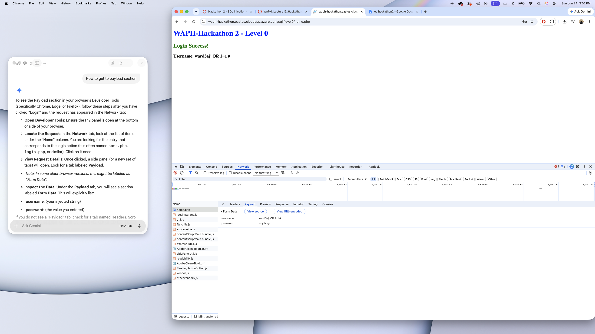
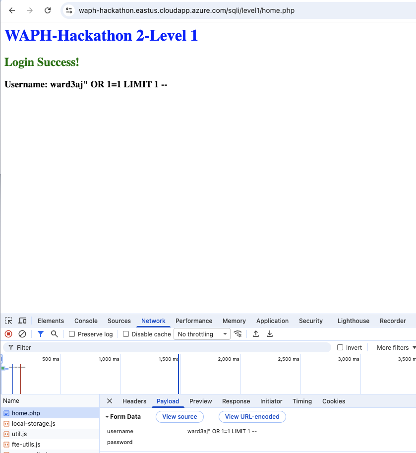
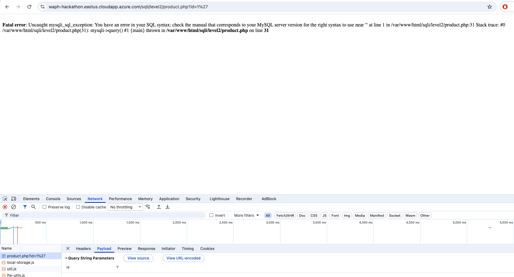
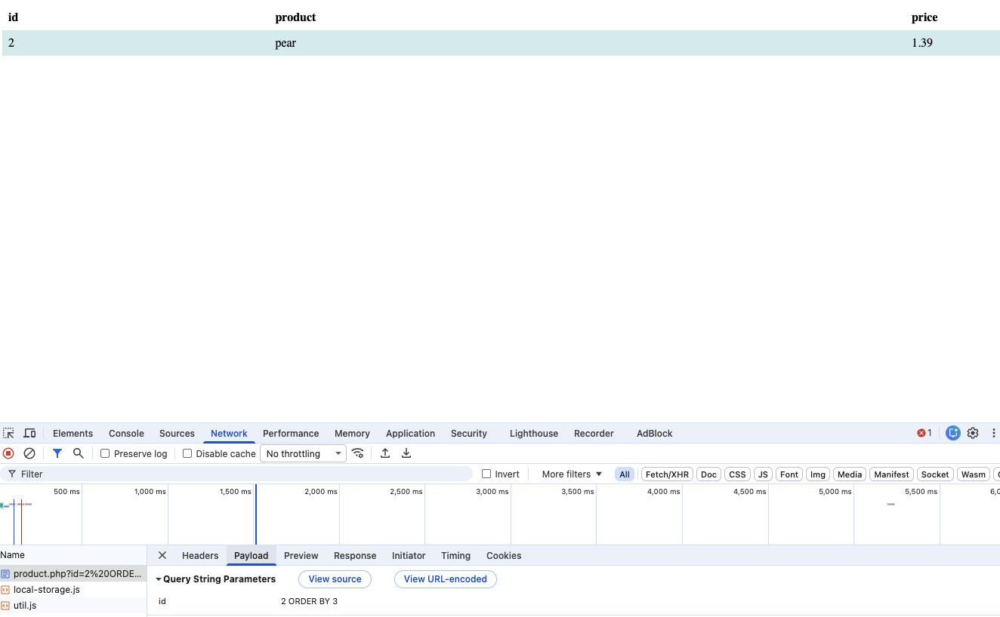
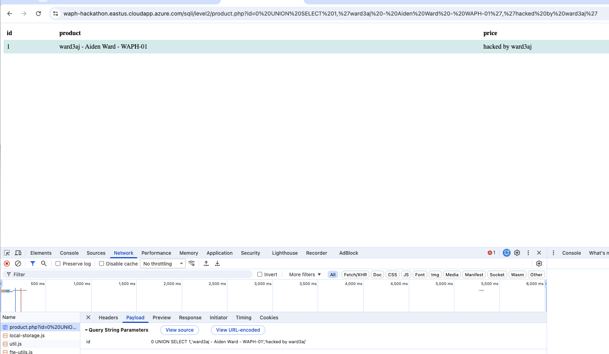
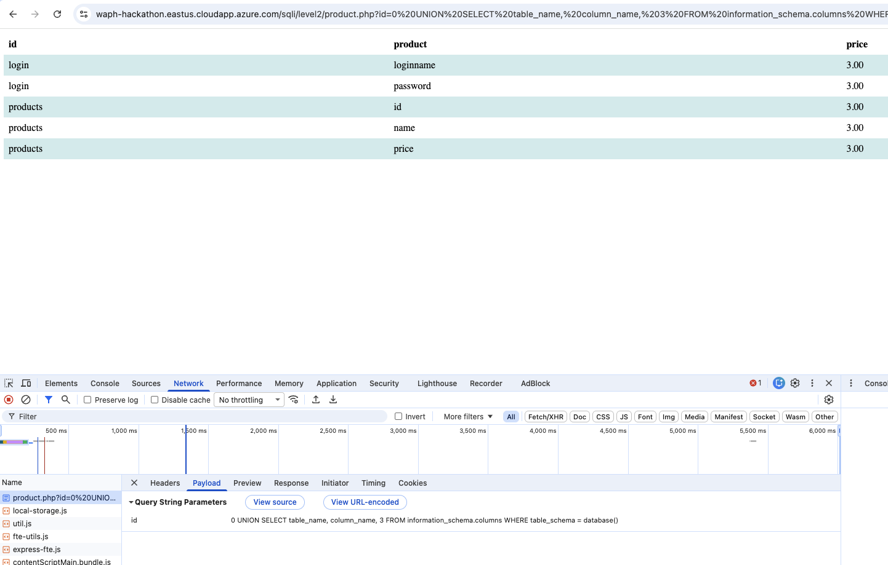
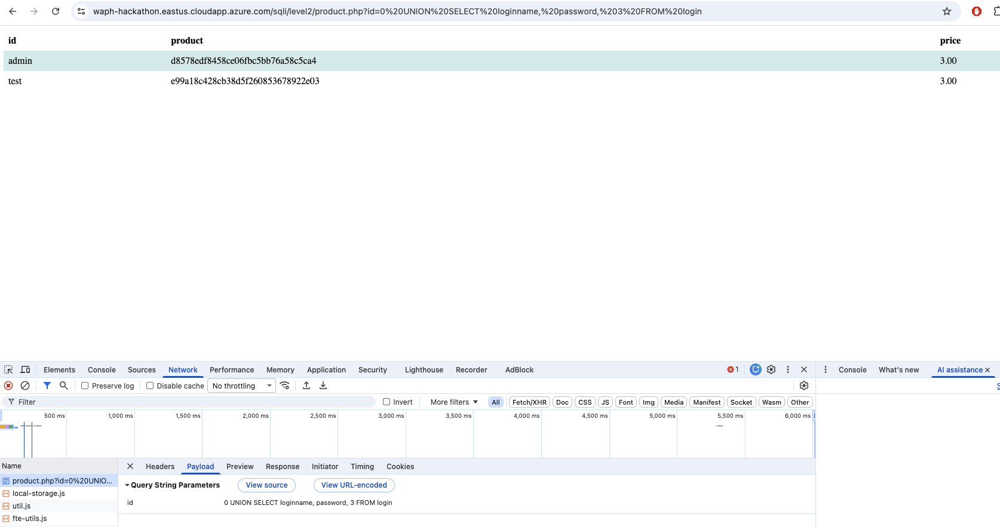
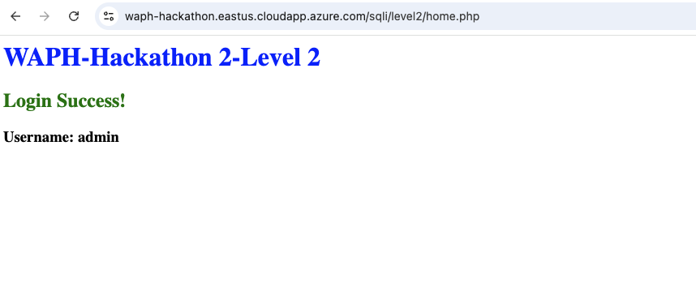
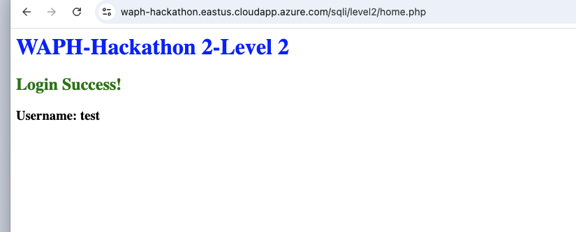

# WAPH-Web Application Programming and Hacking
## Instructor: Dr. Phu Phung
## Student
**Name**: Aiden Ward
**Email**: [ward3aj@mail.uc.edu](mailto:ward3aj@mail.uc.edu)
**Short-bio**: Aiden Ward has a lot of interest in computer science, specifically data science. I also love volleyball and cars.

## Repository Information
Repository's URL: [https://github.com/aidenward6/waph-ward3aj/tree/main/waph-ward3aj/labs/hackathon2](https://github.com/aidenward6/waph-ward3aj/tree/main/waph-ward3aj/labs/hackathon2)

## Overview
This hackathon was all about exploiting SQL injection vulnerabilities in a few different vulnerable login pages. There were 3 levels, Level 0 and Level 1 were pretty similar where the goal was just to bypass the login form using a crafted SQL payload, and Level 2 was alot harder since the obvious login form was actually safe and I had to find a different injection point, then use it to dump the whole database including the admin credentials. This was a really good learning experience for understanding how dangerous it is when an app just concatenates user input straight into a SQL query with no validation.

---

## Level 0 

### Task
Inject SQL with my username to bypass the login and get into the system without a real password.

### Approach
This form has basically zero protection, the backend query is something like:
SELECT * FROM users WHERE username='input' AND password=md5('input')

So all I had to do was close the quote early, add an OR 1=1 so the condition is always true, then comment out the rest of the query so the password check never even runs.

### Payload used
ward3aj' OR 1=1 #

### Outcome
Logged in successfully, the page just reflects my whole injected string back as the username since theres no sanitization at all.

---

## Level 1 

### Guessing the backend
This one was not exactly the same as Level 0 so I had to feel it out a bit. I put just a single double quote as the username and it threw a SQL error that showed the query actually wraps the username in double quotes instead of single quotes like Level 0 did. The error looked something like:

Fatal error: Uncaught mysqli_sql_exception... near '""" AND password = md5('fds')' at line 1

So the real query is something like:
SELECT * FROM users WHERE username="input" AND password = md5('input')

### The attack 
At first I just tried closing the double quote and adding OR 1=1, but that actually matched every single user in the table and the app rejected it as invalid login, probably because it expects exactly one row back. Adding LIMIT 1 fixed that since it forces only one row to come back.

### Final payload
ward3aj" OR 1=1 LIMIT 1 -- 

(needs a space after the -- or mysql wont treat it as a comment)

### Outcome
Logged in fine, screenshot below shows the payload in the network tab too.

---

## Level 2

This level was way trickier since the main login form here is actually safe. The real vulnerability is somewhere else in the app.

### a. Finding the vulnerability
Clicking into a product gave me a url like product.php?id=2, so I tried throwing a single quote on the end of the id value and it broke the query with a fatal SQL error, confirming id is injectable and not sanitized at all.

I also noticed I didnt even need the quote, just doing id=2 OR 1=1 with no quote at all returned both products, so id is being treated as a raw number in the query, not a quoted string, which made things alot easier going forward.

### b. Getting data out 

**i. Finding the column count**
Used ORDER BY trial and error on the id param. ORDER BY 1, 2, and 3 all worked fine but ORDER BY 4 threw an unknown column error. So the query has 3 columns total (id, product, price).

**ii. Showing my own info**
Used a UNION SELECT with id=0 so no real product shows up, and put my info into the string columns:
product.php?id=0 UNION SELECT 1,'ward3aj - Aiden Ward - WAPH-01','hacked by ward3aj'

This displayed my username, name and section right there on the product page.

**iii. Dumping the schema**
Used information_schema.columns to list out every table and column in the db:
product.php?id=0 UNION SELECT table_name, column_name, 3 FROM information_schema.columns

That also pulled in a ton of mysql system tables so I narrowed it down to just the app's own database with:
product.php?id=0 UNION SELECT table_name, column_name, 3 FROM information_schema.columns WHERE table_schema = database()

This showed two real tables, login with columns loginname and password, and products with id, name, price.

**iv. Getting the actual credentials**

Table and columns that store the login info: the login table, columns loginname and password.

Query used to dump everyone's username and password:
product.php?id=0 UNION SELECT loginname, password, 3 FROM login

This came back with two accounts. admin with hash d8578edf8458ce06fbc5bb76a58c5ca4, and test with hash e99a18c428cb38d5f260853678922e03.

Both of those are 32 character hex strings so they're obviously md5 hashes. I looked them up on an md5 lookup site and cracked them pretty easily since they're common passwords. admin's password is qwerty, and test's password is abc123.

### c. Logging in with the stolen creds
Went back to the normal Level 2 login form and just logged in like a regular user with admin / qwerty, no injection needed at this point since I already had real credentials.

Also confirmed the test account works the same way.

---

## Conclusion
This hackathon really showed me how bad it can get when user input gets dropped straight into a SQL query without any validation. Levels 0 and 1 were pretty quick once I figured out the quote style being used, but Level 2 took alot more digging since I had to actually find the vulnerable spot first before I could even start exploiting anything. Definitely makes me appreciate why prepared statements exist, since literally none of this would have worked if the backend had used them instead of just concatenating strings.
