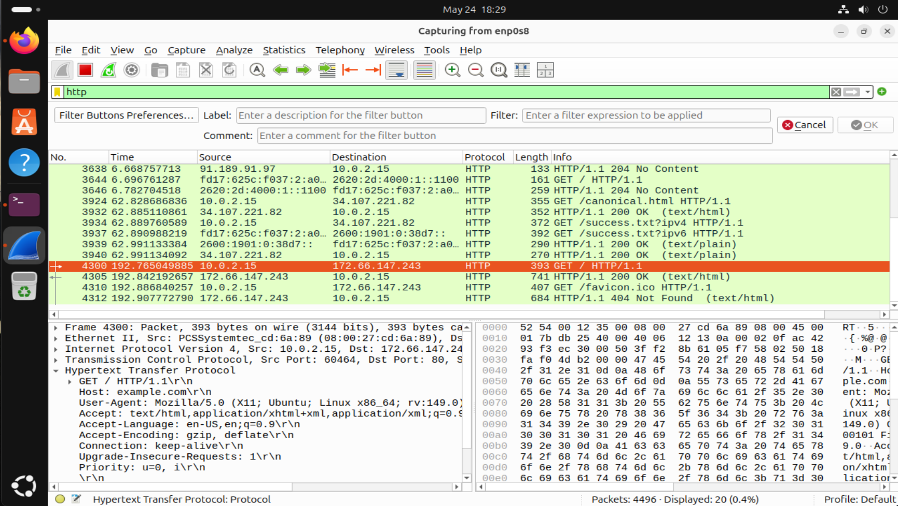
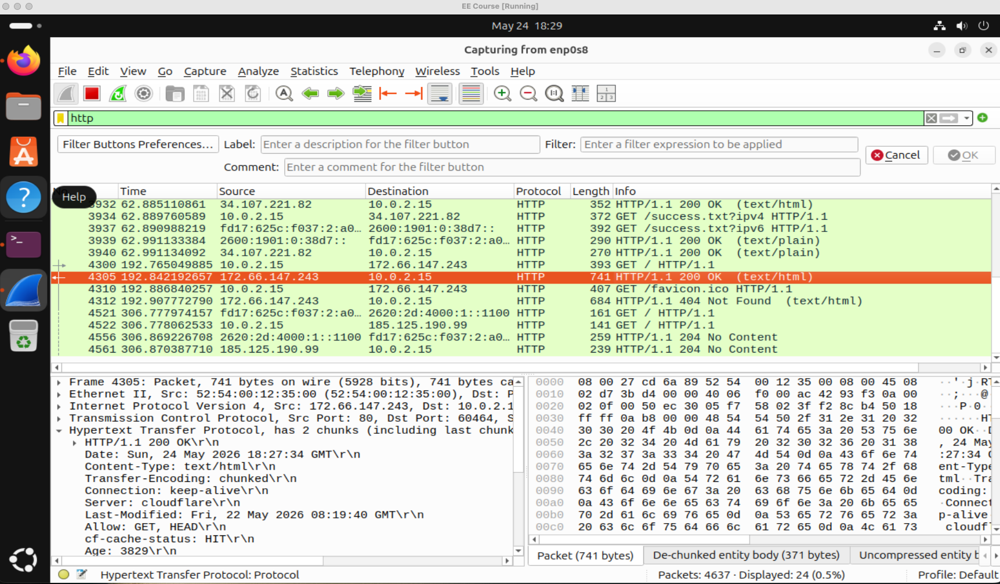
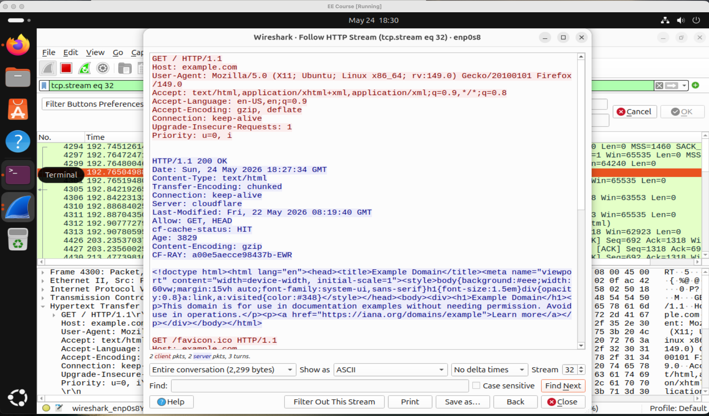
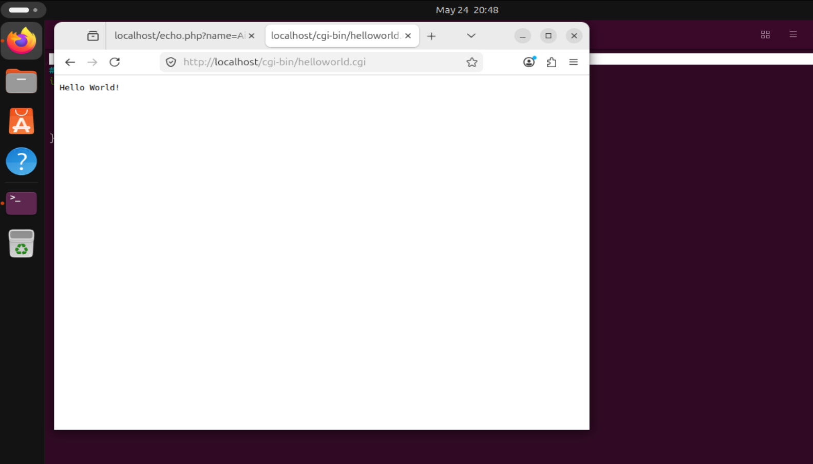
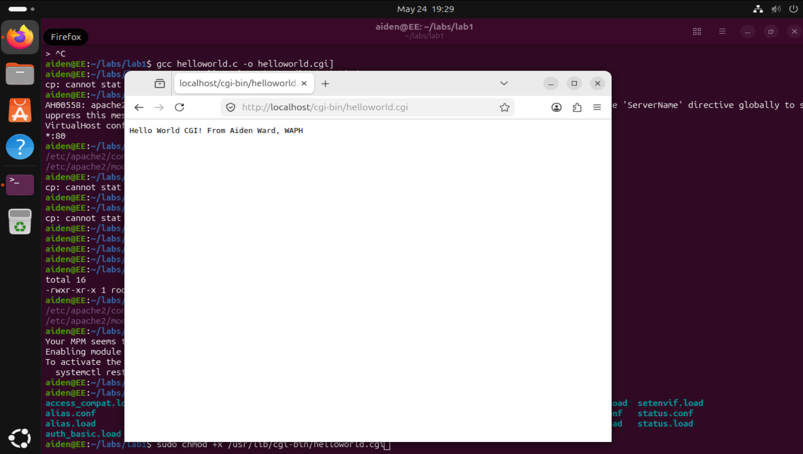
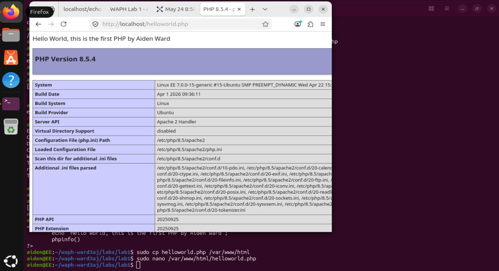
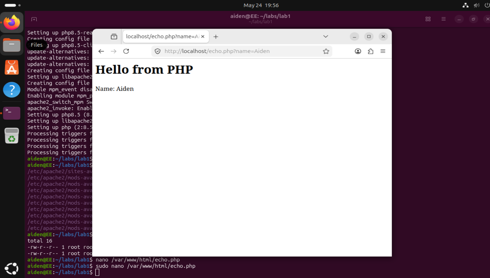
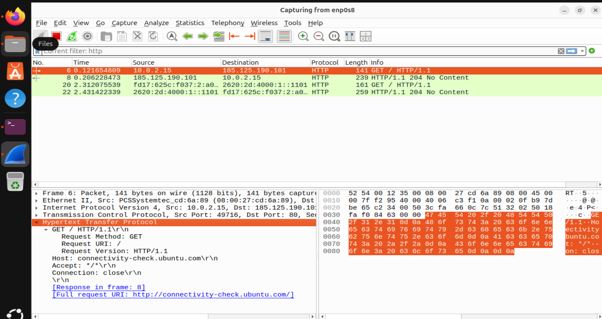
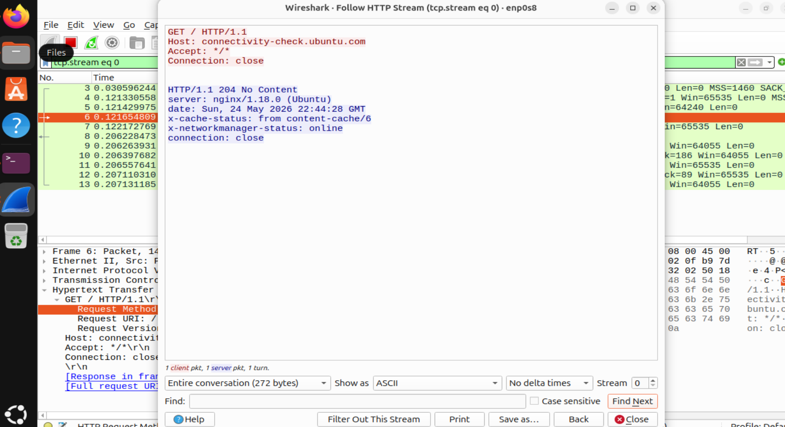
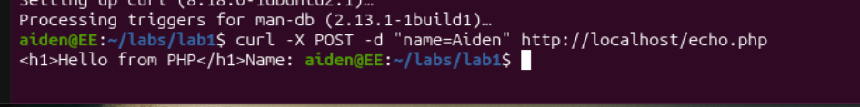

# WAPH-Web Application Programming and Hacking

## Instructor: Dr. Phu Phung

## Student

**Name**: Aiden Ward

**Email**: [ward3aj@mail.uc.edu](ward3aj@mail.uc.edu)

**Short-bio**: Aiden Ward has a lot of interest in computer science, specifically data science. I also love volleyball and cars. 


## Repository Information

Respository's URL: [https://github.com/aidenward6/waph-ward3aj/tree/main/waph-ward3aj/labs/lab1)


Overview
The lab overall allowed me to explore HTTP protocol. I havent done this in quite some time, so I was excited to do this lab. I developed and deployed basic web applications using C and PHP. I also utilized wireshark and telnet to analyze the mechanics of request and response headers.


Part 1

Task 1
I used the wireshark tool to examine the HTTP protocol by filtering for the HTTP protocol while browsing so, in real time, I could inspect the actual request and response headers. 
Task 2
I used the telenet program to send a TCP connection to localhost:80. Then in the terminal i typed a minimal HTTP request while running wireshark to capture network traffic. Then filtering by http, I could filter to only see the packets generated by telnet.

1.
2.There is a difference between this HTTP request and the one the browser sent as the manual telnet request is more concise than browser one. My request included only the essential method, path, and host header whereas in the browser one, it automatically appends different fields. The missing fields in the telnet request show that the browser adds metadata when doing automatically. 
3.To my knowledge, there isnt a big difference in HTTP response structure when requested by either a browser or telnet. Just follows standard HTTP protocol.


Part 2

Task 1
A. I developed teh code in C then Compiled the code using gcc compiler and moved the file to the default location for apache cgi scripts. Then after this I made sure that the file was executable by running chmod +x so that the web server could actually run when its accessed by the browser. 

B. I developed Hello World CGI by writing a C script that outputs the mandatory content-type: text/html header followed by the HTML body. And did all the same steps as last one, but included more details on this. 

```
#include <stdio.h>
int main(void) {
  // CGI header
  printf("Content-Type: text/html; charset=utf-8\n\n");
  
  // HTML Template
  printf("<!DOCTYPE html><html>");
  printf("<head><title>WAPH Lab 1 - Aiden Ward</title></head>");
  printf("<body>");
  
  // Required Header and Paragraphs
  printf("<h1>Web Application Programming and Hacking</h1>");
  printf("<p>Student: Aiden Ward</p>");
  printf("<p>Course: WAPH - Spring 2026</p>");
  
  printf("</body></html>\n");
  
  return 0;
}
```




Task 2
A. I made a helloworld.php file which contains <?php phinfo(); ?> then deployed it to var/www/html/ directory. Then I could access this file via the browser. There are security risks in a simple web app. As the php file contains data directly from the URL, its vulnerable to cross site scripting which is when someone enters malicious code into the URL parameter, and the browser executes this malware. There are different ways to make sure this doesnt happen. For example, htmlspecialchars, which is what we did.


B. I then developed an echo.php file that accepts user input through entering your name in the URL parameter and then displaying it back on the page. 

```
<?php
echo "<h1>Hello from PHP</h1>";
echo "Name: " .
htmlspecialchars($_GET['name']);
?>
```




Task 3
A. I used wireshark to examine HTTP and GET request on enp0s8 and applying http filter. While I was capturing, I accessed echo.php page in the vm browser. I then stopped capturing and found the GET request packet. Then by right cflicking the packet and selecting Follow then HTTP stream, I could examine the text of the request header.
 
B. 
C. The similarity between GET and POST requests is both methods serve as the transport layer for delivering client data to the echo.php script. In both situations, the script gets the input name in the URL and triggers the server-side logic so that it could be shown on the page through HTML code. The big difference between them is data encapsulation. GET appends the data to the URL where POST puts the data in the HTTP request body. The post is the more common practice as putting data in the URL is not the smartest option in some scenarios. There really is no difference between the two HTTP responses as the echo script processes the name variable whether its queried or in the body. 

