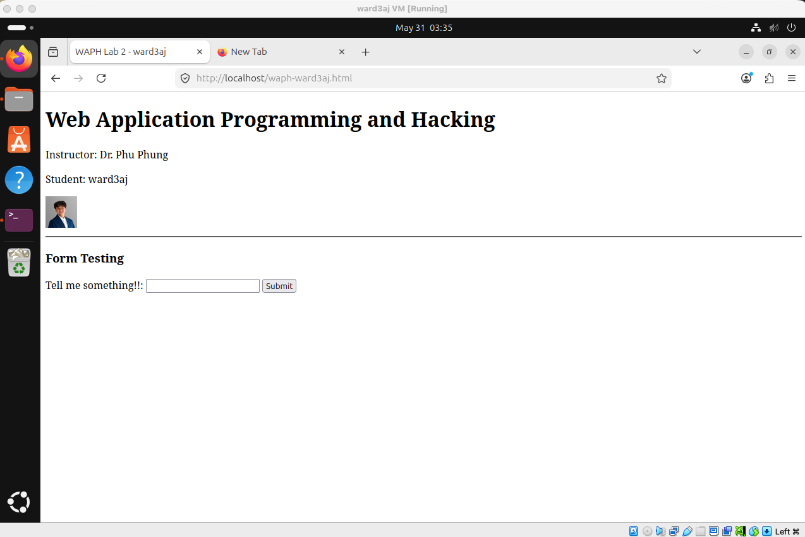
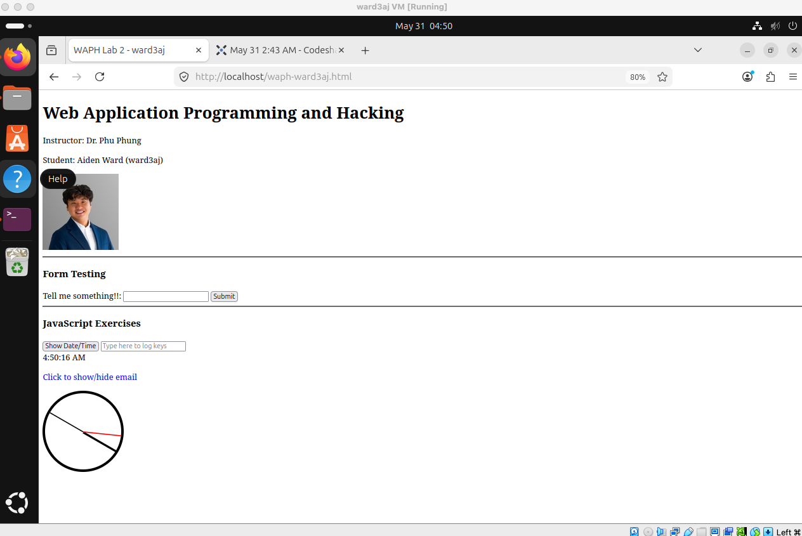
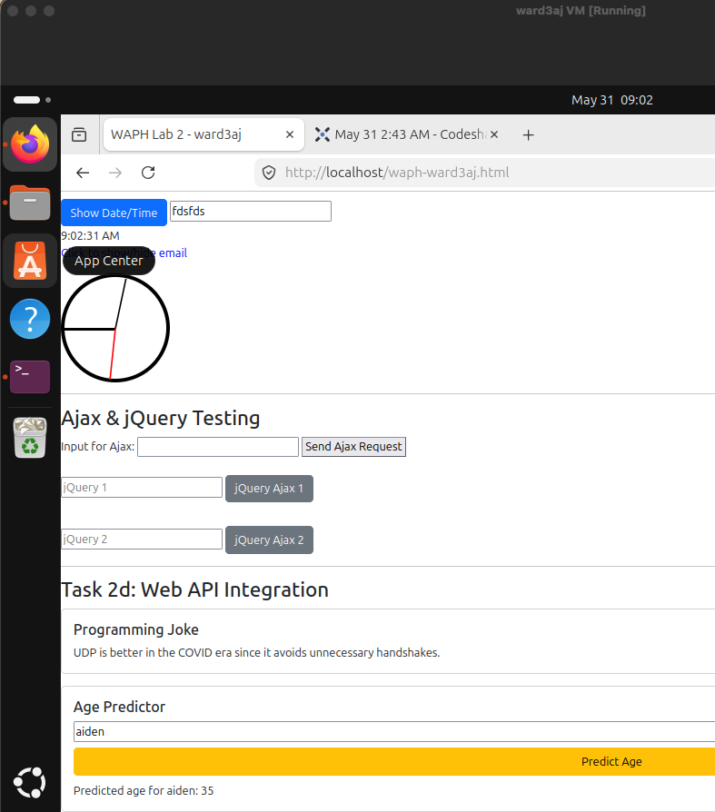
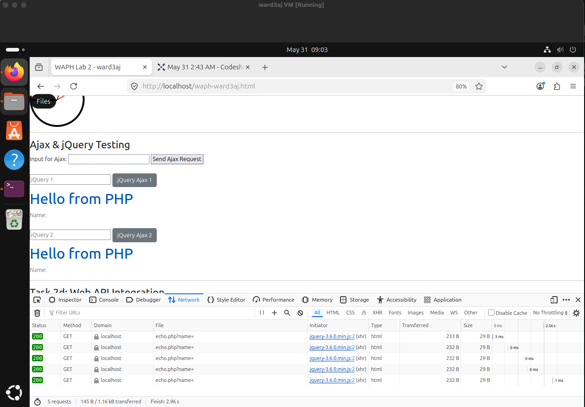

# WAPH-Web Application Programming and Hacking

## Instructor: Dr. Phu Phung

## Student

**Name**: Aiden Ward

**Email**: [ward3aj@mail.uc.edu](ward3aj@mail.uc.edu)

**Short-bio**: Aiden Ward has a lot of interest in computer science, specifically data science. I also love volleyball and cars.


## Repository Information

Respository's URL: [https://github.com/aidenward6/waph-ward3aj/tree/main/waph-ward3aj/labs/lab2](https://github.com/aidenward6/waph-ward3aj/tree/main/waph-ward3aj/labs/lab2)

## Overview

For this lab, I built a front end web page with js and css features. I learned how to make it interact with servers and external data sources. The main thing that I was excited to work on with this lab was working with javascript and also using async requests like ajax and fetch api to pull data. Before I started this lab and was just reading through the directions, I was incredibly excited as I need to work on my javascript skills as I haven't really made a lot with javascript over my academic courses and internships.

## Task 1: Basic HTML and JavaScript

I started by building the basic HTML structure. I added my headshot, a form for user input, and set up the JavaScript files for the clock and email toggle.

* **Sub-task a & b:** I used inline JS for the date alert and key logging. For key logging, I added an `onkeydown` attribute directly in the input tag so that every keypress gets logged to the console. I also set up a digital clock using a `<script>` tag that calls `setInterval` every second to update the displayed time, and an analog clock using an external JS file (`analog.js`) that handles rotating the clock hands. It was pretty straightforward getting the clock hands to rotate using basic CSS transitions.

**Code Snippet (Key Logging):**

```html
<input type="text" onkeydown="console.log('Key pressed: ' + event.key)"
       placeholder="Type here to log keys">
``` 

**Code Snippet (Digital Clock):**

```javascript
function updateClock() {
    document.getElementById('digital-clock').innerHTML = new Date().toLocaleTimeString();
}
setInterval(updateClock, 1000);
```





## Task 2: Ajax, CSS, jQuery, and Web API Integration

This was the core part of the lab. I had to make the page interactive using different ways to fetch data.

* **Sub-task a, b, & c (Ajax and jQuery):** I covered all three CSS types: inline (e.g., `style="cursor:pointer;"` on clickable elements), internal (a `<style>` block in the `<head>`), and external (Bootstrap via CDN link). For the Ajax part, I used the `XMLHttpRequest` object first to send data to the echo.php app. Then, I switched over to jQuery which made the code a lot shorter. I set up two buttons that trigger jQuery Ajax GET requests to echo.php and display the response. I made sure to inspect the network tab in the browser to confirm everything was returning a 200 OK status.

**Code Snippet (jQuery Ajax):**

```javascript
$("#btn-1").click(function(){
    $.ajax({
        url: "/echo.php",
        type: "GET",
        data: { name: $("#jquery-input-1").val() },
        success: function(res){ $("#jquery-result-1").html(res); }
    });
});
```





* **Sub-task d (Web API Integration):** This was the most interesting part. I used jQuery Ajax to grab a random programming joke from the JokeAPI as soon as the page loads so users immediately see something dynamic. Then I used the `fetch()` method to let users type a name and get a predicted age back from the Agify API. The fetch call chains `.then()` handlers to parse the JSON response and inject the result directly into the DOM. It was cool to see how easily you can pull JSON data from external sites and inject it right into the page.

**Code Snippet (Fetch API - Age Predictor):**

```javascript
function getAge() {
    const name = $("#name-input").val();
    fetch('https://api.agify.io/?name=' + name)
        .then(response => response.json())
        .then(data => {
            $("#age-result").text('Predicted age for ' + data.name + ': ' + data.age);
        });
}
```

