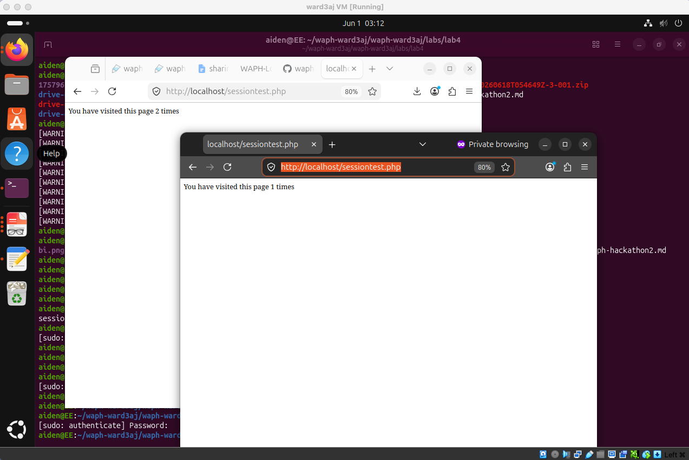
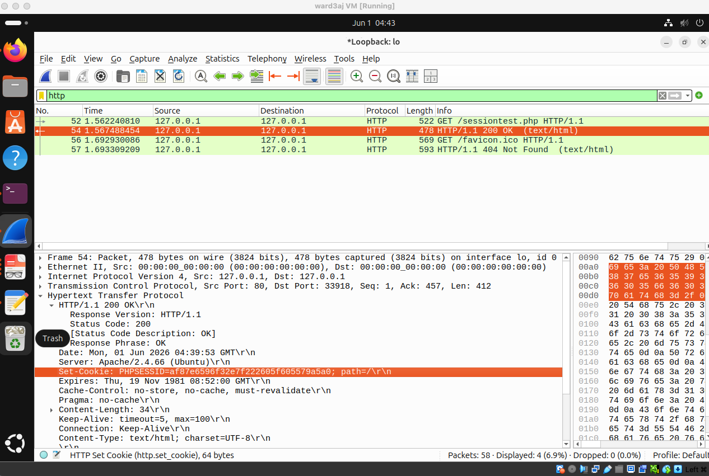
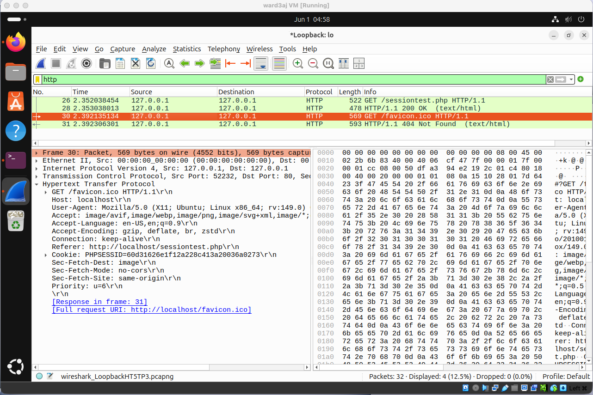
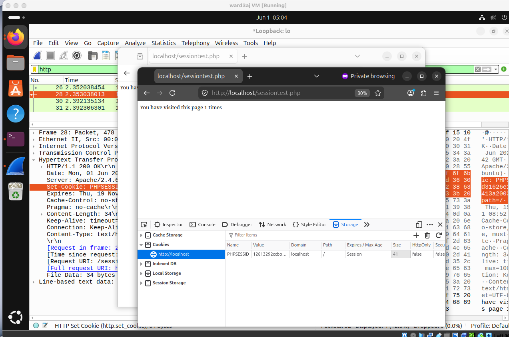
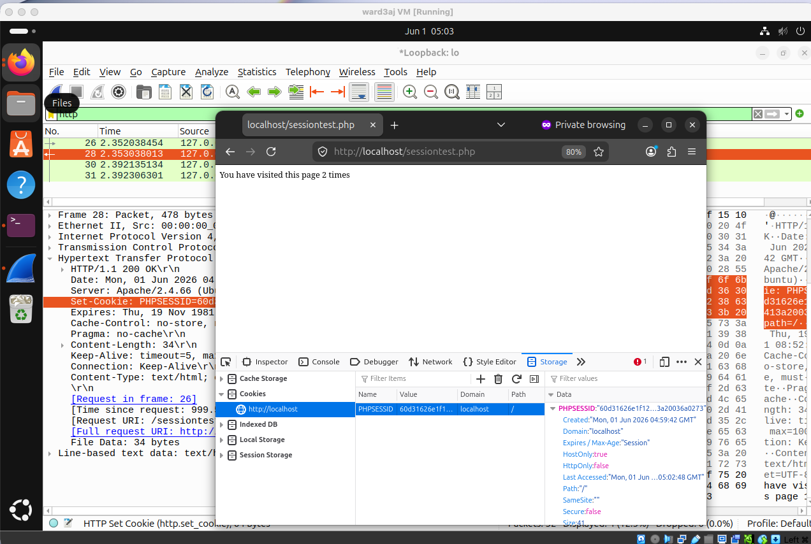
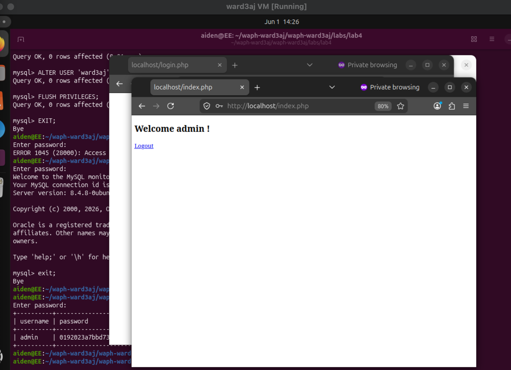
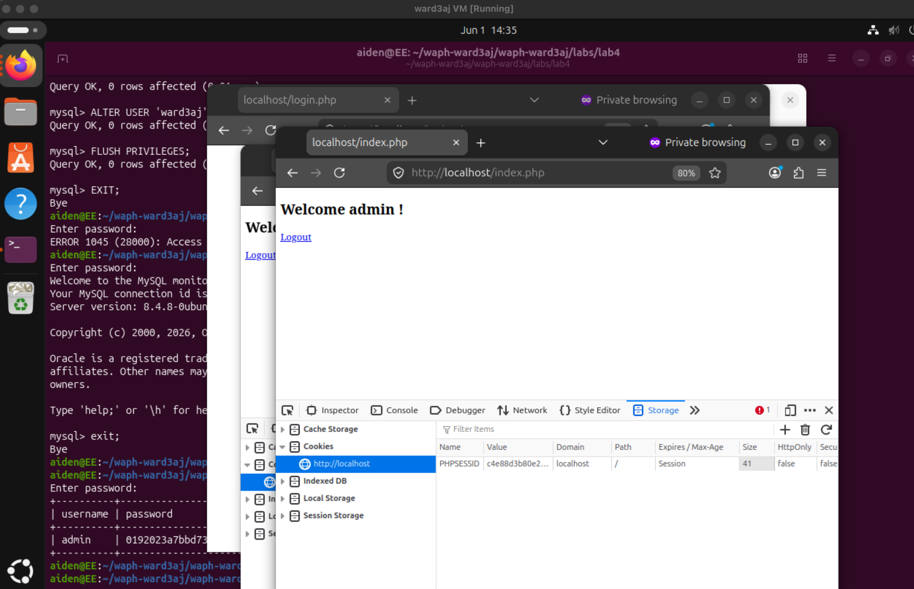
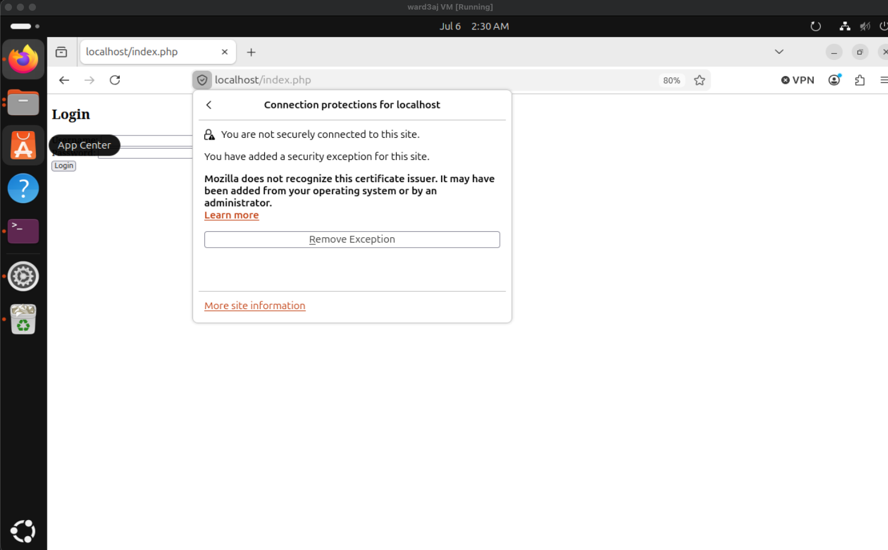
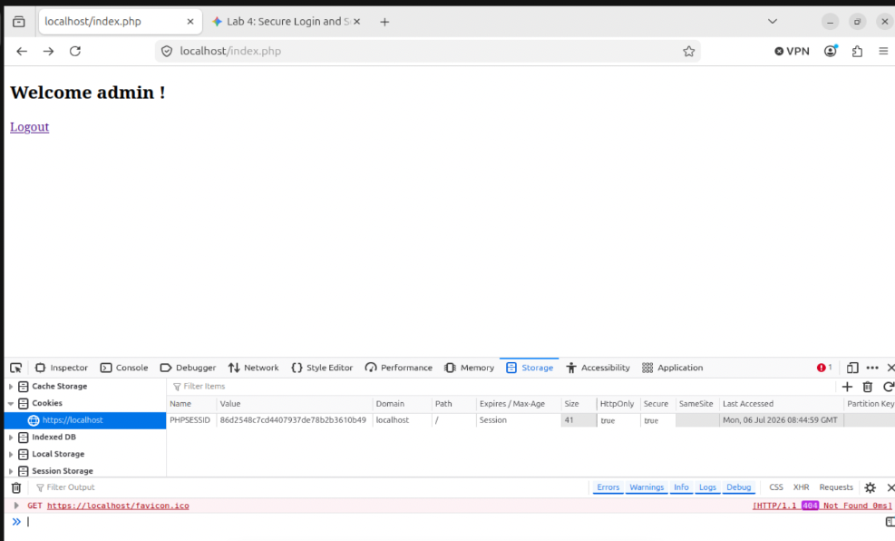
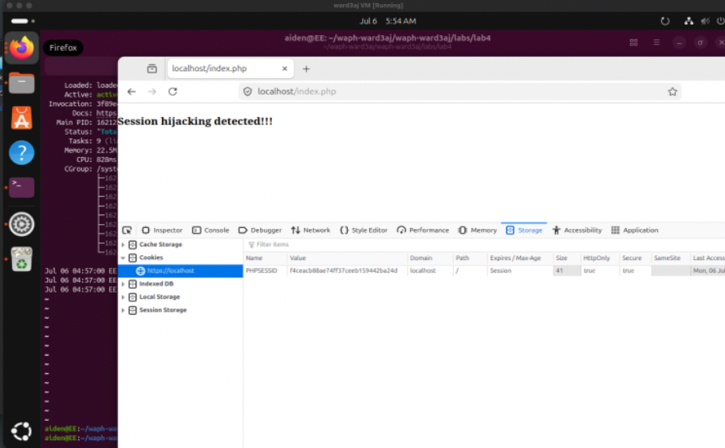

# WAPH-Web Application Programming and Hacking

## Instructor: Dr. Phu Phung

## Student

**Name**: Aiden Ward

**Email**: [ward3aj@mail.uc.edu](ward3aj@mail.uc.edu)

**Short-bio**: Aiden Ward has a lot of interest in computer science, specifically data science. I also love volleyball and cars.

## Repository Information

Respository's URL: [https://github.com/aidenward6/waph-ward3aj/tree/main/waph-ward3aj/labs/lab4](https://github.com/aidenward6/waph-ward3aj/tree/main/waph-ward3aj/labs/lab4)

## Overview

For this lab I worked on understandin how session management works in PHP applications. The main goal was to deploy session handlin and see how servers and browsers communicate. I also focused on identifyin session hijackin vulnerabilities and applyin security fixes like HTTPS and cookie flags to prevent these attacks. It was a good experience seein these security concepts applied directly to code.

## Task 1: Understanding Session Management in a PHP Web Application

For sub-task 1a I deployed the sessiontest.php file to my server. I accessed the page from two different browsers which gave me different session values because each browser manages its own cookie storage.

In sub-task 1b I used Wireshark to look at the traffic. I captured the initial HTTP request which lacked a cookie and the subsequent response where the server sent the session cookie. This showed me the handshake process where the server establishes the session state. 

For sub-task 1c I performed a session hijackin attack. I was able to take a session ID from one instance and use it in another to access the session.

## Task 2: Insecure Session Authentication

In sub-task 2a I updated my login system to use PHP sessions. I made sure that only users with the correct credentials could access the main page. If a user tries to access the page without loggin in they get sent back to the login screen.

For sub-task 2b I hijacked the session again by copyin the session ID from one browser and injectin it into another. This let me bypass the login form and get into the session-protected page.

## Task 3: Securing Session and Session Authentication

In sub-task 3a I set up HTTPS on my local server usin self-signed SSL certificates. I had to add a security exception in the browser to accept the cert but this confirmed that my traffic was encrypted. 

For sub-task 3b I secured the session cookies by settin the HttpOnly and Secure flags usin session_set_cookie_params. This makes the cookie invisible to javascript and ensures it only travels over HTTPS. 

Finally in sub-task 3c I implemented a defense in depth strategy. I added a check to my index.php that compares the current browser User-Agent with the one stored in the session. If they dont match the server destroys the session and denies access which prevents basic hijackin attempts.

