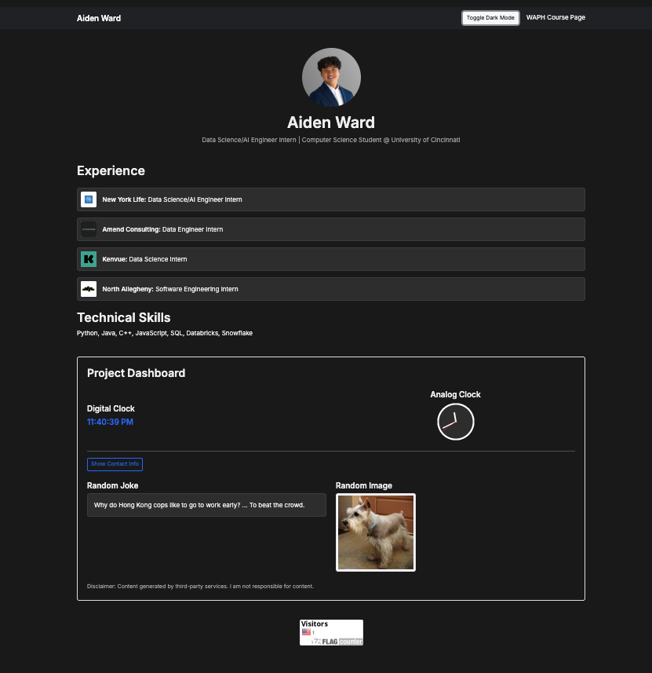
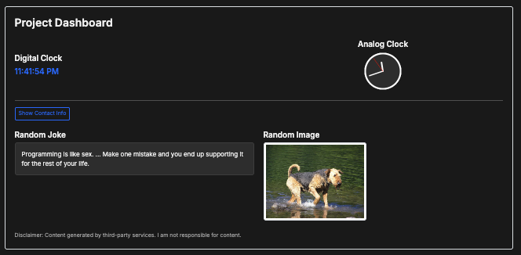
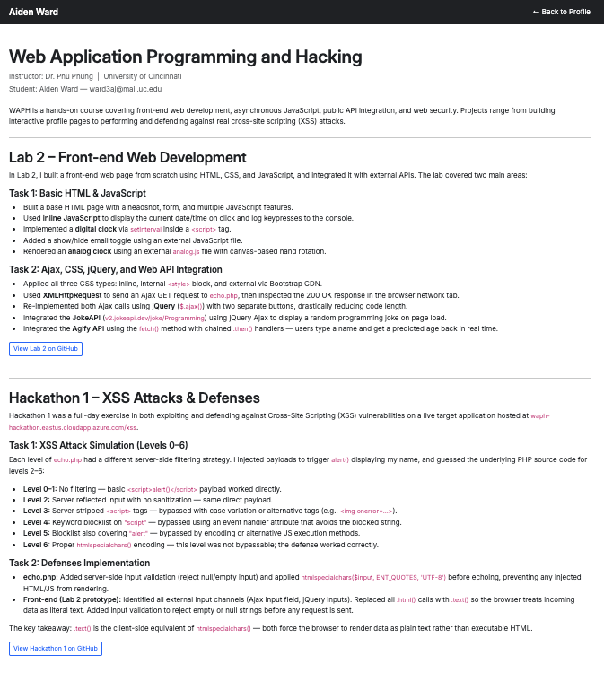

# WAPH-Web Application Programming and Hacking

## Instructor: Dr. Phu Phung

## Student

**Name**: Aiden Ward

**Email**: [ward3aj@mail.uc.edu](mailto:ward3aj@mail.uc.edu)

**Short-bio**: Aiden Ward has a lot of interest in computer science, specifically data science. I also love volleyball and cars.

## Repository Information

Repository's URL: [https://github.com/aidenward6/ward3aj-waph-project1](https://github.com/aidenward6/ward3aj-waph-project1)

## Overview

This project was super interesting as it helped me better understand web development and also create a cool portfolio in the process. The main purpose was to build and deploy a professional portfolio on GitHub Pages and make it accessible for people, especially future employers. Throughout this process, I learned a lot more about web development — how to structure a responsive layout using an external framework, implement client-side data storage using cookies, and manage asynchronous JavaScript to fetch data from multiple public APIs. Deploying the site to GitHub Pages taught me how to manage a live cloud-hosting environment, and I feel that this project was super interesting and also helpful for my career.

**Deployed website:** [https://aidenward6.github.io/ward3aj-waph-project1/](https://aidenward6.github.io/ward3aj-waph-project1/)

**Project folder on GitHub:** [https://github.com/aidenward6/waph-ward3aj/tree/main/waph-ward3aj/labs/project1](https://github.com/aidenward6/waph-ward3aj/tree/main/waph-ward3aj/labs/project1)

## General Requirements

For the general requirements, I made a comprehensive personal portfolio to serve as my professional profile. I included my resume details, highlighting my education at the University of Cincinnati (B.S. Computer Science, Statistics minor, expected graduation Spring 2027) and work experiences across four internships. I integrated my professional headshot and contact information to make sure that the site functions effectively as a job application portal. I also created a separate, linked HTML page dedicated to introducing the WAPH course and the related hands-on projects we completed. Both pages were structured cleanly and successfully deployed live on GitHub Pages.

## Non-Technical Requirements

To make sure that the website was visually appealing and responsive for potential employers, I used the Bootstrap open-source CSS framework which allowed me to create a modern, structured interface with clean spacing and graphics. To satisfy the analytics requirement, I implemented a page tracker by embedding a FlagCounter widget at the bottom of my main profile page which actively monitors incoming traffic and provides visual analytics on visitor engagement and locations.

## Technical Requirements

### Basic JavaScript Code

For this I implemented dynamic DOM manipulation using jQuery and the js-cookie library as my two JavaScript frameworks. jQuery handled all DOM interactions and AJAX calls, while js-cookie managed reading and writing browser cookies for the returning visitor feature. For the basic functionality, I built a digital clock using the setInterval function to update the time every second. I also built a fully functional analog clock utilizing an HTML5 Canvas element which uses JavaScript math functions to draw and rotate the hour, minute, and second hands in real time. I added a toggle button to show and hide my email address, and implemented a dark mode switch as my additional custom functionality to enhance the user experience.

### Web API Integration

For the public API integration requirement, I used jQuery AJAX calls to connect to two services. First, I integrated the v2 JokeAPI, where I used a setInterval function to automatically fetch and display a new joke from the "Any" category every sixty seconds. I also integrated the Dog CEO API to fetch and display a random dog picture when the page loads — every time the page refreshes there is a new dog image. Beneath both of these elements I included a hardcoded disclaimer explicitly stating that the content is generated by public third-party services and that I am not responsible for it.

### JavaScript Cookies

I implemented user tracking using js-cookie to read and write browser cookies. The script checks for a stored `lastVisit` cookie whenever the page loads. If it is the user's first visit, the script triggers an alert welcoming them to the homepage for the first time. If they are a returning user, the script reads the stored timestamp to display an alert with their exact last visit time. After the check runs, the script immediately updates the cookie with the current date and time to ensure the stored value is always accurate for their next visit.